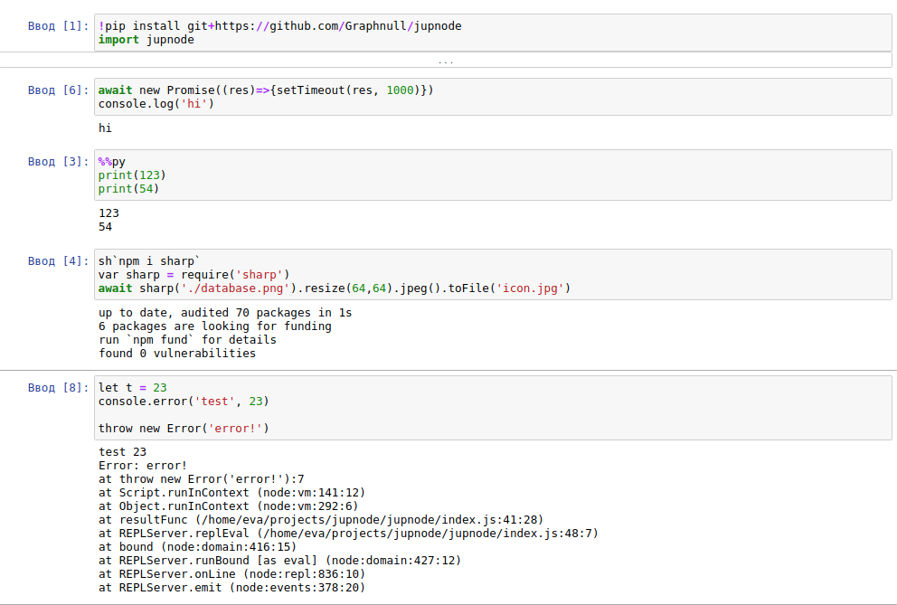

# jupnode

Jupnode lib for enable a Jupyter Notebook user to invoke Node.js commands.



# Prerequisites

You need Node.js/npm installed. See the Node.js downloads page to find an installer for your platform.

# Using

After this cell other cells will run on node.js.

```python
!npm i jupnode
import jupnode
```

Use %%py for use python in cell

```python
%%py
print(123)
print(54)
```

You can use await in top level

```js
fs = require("fs");
await fs.promises.readFile("example.txt");
```

Use var for global usage. Use let, const variables for local usage in cell

```js
var globalVar = 1;
let variableInCell = 2;
console.log(globalVar, variableInCell);
// 1 2
```

```js
// 1
console.log(globalVar);
console.log(variableInCell);
// ReferenceError: variableInCell is not defined
```

Use "sh" global function for system operations

```js
//install npm package
sh("npm i @tensorflow/tfjs-node");
//or
sh`npm i @tensorflow/tfjs-node`;

//download file
let folder = "./";
sh`wget -nv http://pjreddie.com/media/files/VOCtrainval_06-Nov-2007.tar -P ${folder}/`;
```

# Formatted output

Use "html" or "image" functions for formatted output

```js
//show html
html(`<p>This is html</p>`);

//show image base64
image("data:image/jpeg;base64, LzlqLzRBQ...<!-- base64 data -->");

//show image url
image("https://kstatic.googleusercontent.com/...");
```
